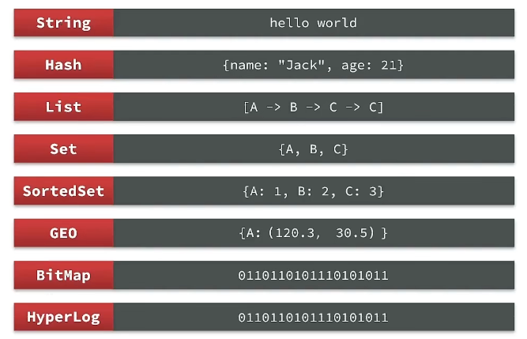
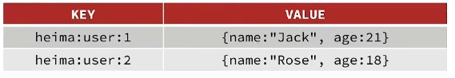
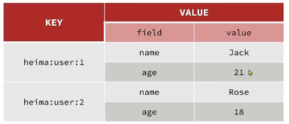
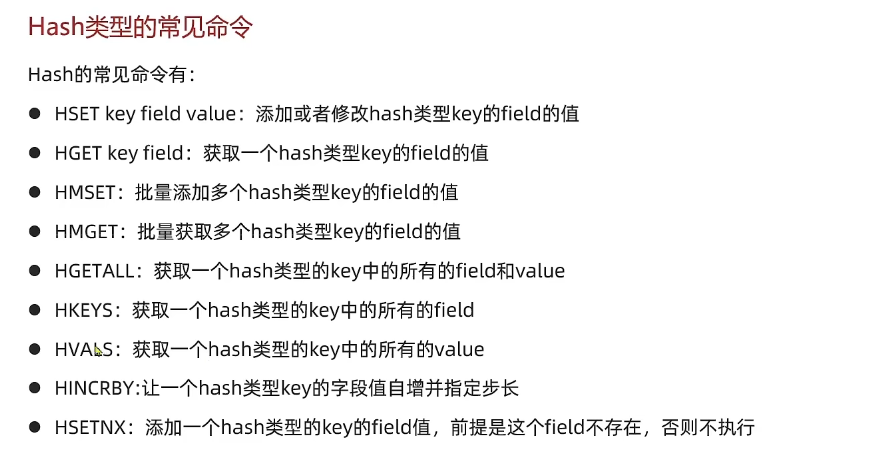
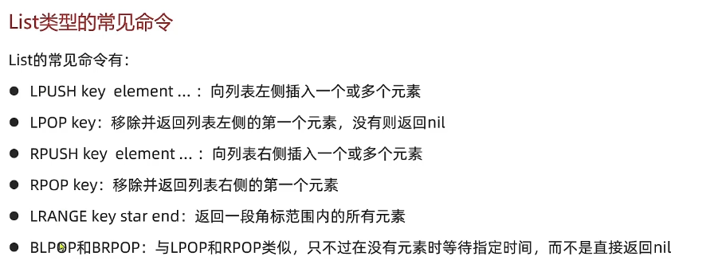

# Redis学习笔记

## 搭建Docker的Redis环境

拉取Redis镜像

```
docker pull redis
```

启动Redis容器和进入Redis容器

```
docker run -itd -p 6379:6379 redis

docker exec -it redis bash
```

## Redis通用命令

```
//通过模板patter查找key
KEYS pattern

//查找所有key
KEYS *

//删除Key，可以删多个，key不存在也可以
DEL k1 k2 k3 k4

//判断多个key是否存在
EXISTS k1 k2

//给key设置有效期，有效期到期时该key会被自动删除
EXPIRE key seconds

//TTL,查看key有效期,-1代表永久有效，-2代表过期
TLL key

```

## Redis 数据类型

Redis是key-value的数据库。key一般是string类型，value的类型是多种多样



### String类型

String类型，也就是字符串类型，是Redis中最简单的存储类型

String结构是将对象序列化为JSON字符串类型，当需要修改对象某个字段时较为不变

字符串类型的最大空间不能超过512m




### Hash类型

Hash结构可以将对象中的每个字段独立存储，可以针对单个字段做CRUD





Hash单条存储

```
HSET key field 
```

Hash查看单条

```
HGET key field
```

Hash存储多条

```
HMSET key field value [field value ...]
```

Hash查看多条

```
HMGET key field [field ...]
```

Hash查看所有field

```
HGETALL key
```

Hash判断field时候存在

```
HSETNX key field value
```

### List类型

Reids中的List类型可以看做是一个双向链表结构。既可以支持正向检索也可以支持反向检索

List类型特点：

* 有序
* 元素可以重复
* 插入和删除快
* 查询速度慢O(n)

  
*
