### TCP链接管理

* [1.TCP三次握手](#1)
* [1.2.TCP序列号相关知识](#2)
* [1.3.建立链接超时](#3)
* [2.TCP选项](#4)
  
**围绕TCP报文头，我们逐步分析关于TCP连接的相关知识。**

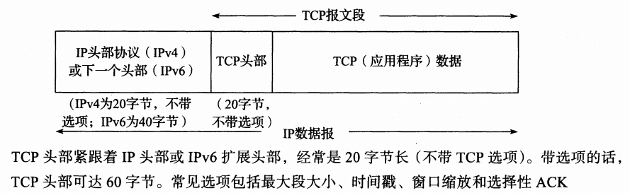

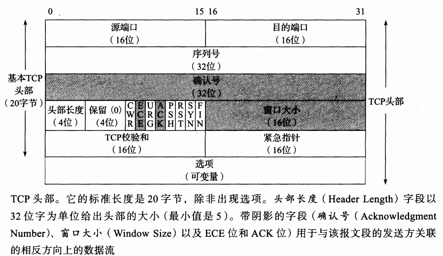

<h3 id="1">TCP三次握手</h3>

&emsp;&emsp;通过发送下述3个报文段就能够完成一个TCP连接的建立。它们也常称作三次握手。**三次握手的目的不仅在于让通信双方了解一个连接正在建立,还在于利用数据包的选项来承载特殊的信息,交换初始序列号(Initial Sequence Number, ISN)**。

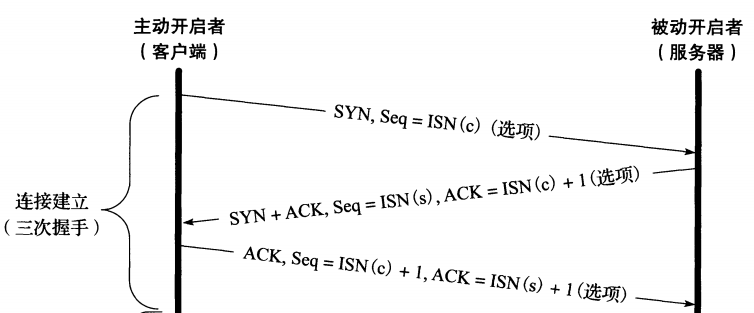

- 存不存在四次握手？及A主机7777端口向B主机8888端口发送SYN的同时，B主机的8888端口向A主机7777端口发送SYN。

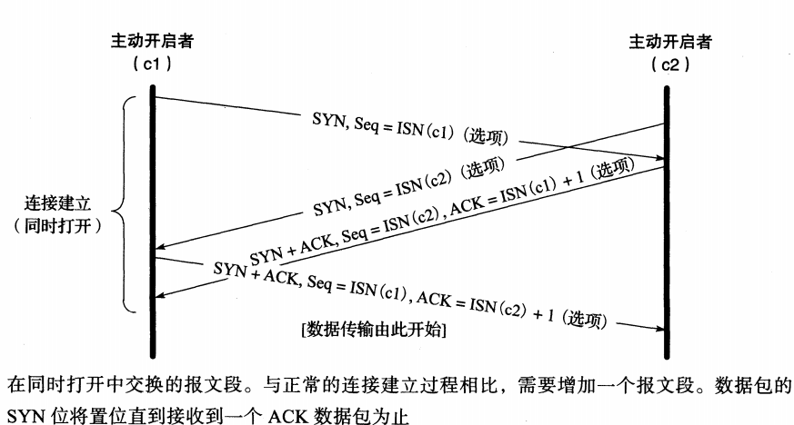

<h3 id="2">TCP序列号</h3>

&emsp;&emsp;当一个连接打开时,任何拥有合适的 **IP地址、端口号、符合逻辑的序列号(即在窗口中)以及正确校验和的报文段**都将被对方接收。然而,这也引人了另一个问题。在一个连接中, TCP报文段在经过网络路由后可能会存在延迟抵达与排序混乱的情况。为了解决这一问题,需要仔细选择初始序列号。
&emsp;&emsp;在发送用于建立连接的SYN之前,通信双方会选择一个初始序列号。初始序列号会随时间而改变,因此每一个连接都拥有不同的初始序列号。 **[RFCO793]指出初始序列号可被视为一个32位的计数器。该计数器的数值每4微秒加10此举的目的在于为一个连接的报文段安排序列号,以防止出现与其他连接的序列号重叠的情况。尤其对于同一连接的两个不同实例而言,新的序列号也不能出现重叠的情况。**
&emsp;&emsp;TCP被双方的IP,端口构成的四元组唯一标识，即同一个连接也会出现不同的实例。所以我们要通过序列号是不是在窗口中来识别不同的实例。此外，一个对数据完整性有较高要求的应用程序也可以在应用层利用CRC或校验和保证所需数据在传输过程中没有出现任何错误。在任何情况下这都是一种很好的方法,并已普遍用于大文件的传输。

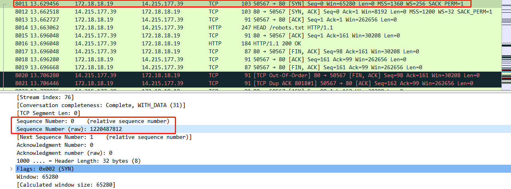

wireshark抓包第一次握手的中随机序列号

<h4 id="3">连接建立超时</h4>
&emsp;&emsp;清单13-1展示了，向子网内一个不存在的主机发送建立TCP请求的抓包记录

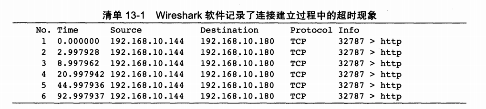
&emsp;&emsp;抓包结果显示了客户端TCP为了建立连接频繁地发送SYN报文段。在首个报文段发送后仅3秒第二个报文段就被发送出去,第三个报文段则是这之后的6秒,而第四个报文段则在第三个报文段发送12秒以后被发送出去,以此类推。这一行为被称作指数回退。
&emsp;&emsp;在linux中的/proc/sys/net/ipv4中的tcp_synack_retries可以看到此参数，一般选择5。

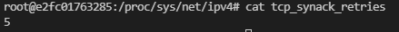

<h4 id="4">TCP选项</h4>

&emsp;&emsp;在TCP头部固定20字节后的选项，最高可达40字节
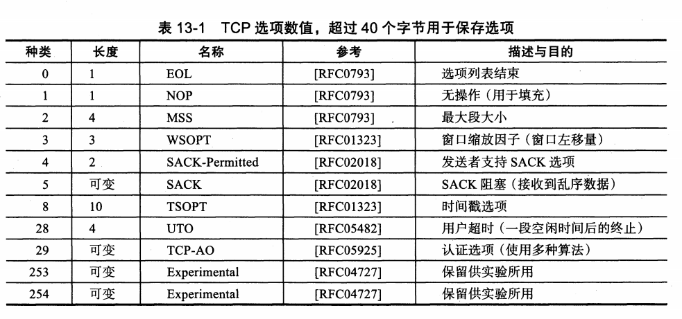

&emsp;&emsp;每一个选项的头一个字节为“种类” (kind),指明了该选项的类型。**根据[RFCl122],不能被理解的选项会被简单地忽略掉。种类值为0或1的选项仅占用一个字节。其他的选项会根据种类来确定自身的字节数Len。选项的总长度包括了种类与Len个字节。设置NOP选项的目的是允许发送者在必要的时候用多个4字节组填充某个字段。需要记住的是TCP头部的长度应该是32比特的倍数,因为TCP头部长度字段是以此为单位的。EOL指出了选项列表的结尾,说明无需对选项列表再进行处理**。在下文中,我们将详细地探究其他选项。

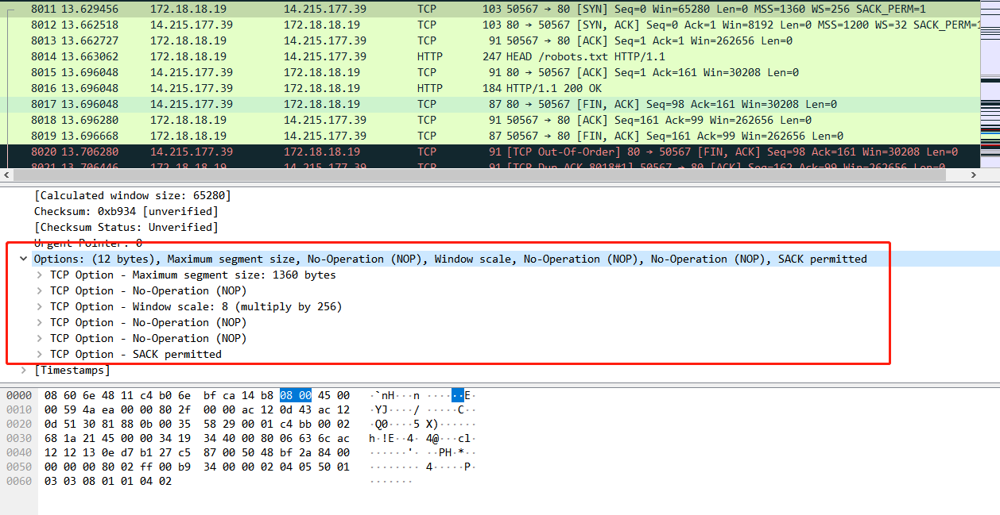

wireshark抓包中的选项

&emsp;&emsp;在wireshark抓包中，我们可以看到TCP Options一共有12字节。其中包含MSS,NOP,Window scale,SACK选项。NOP类型是只有Kind，占一字节，用于凑齐32位。MSS类型是有Kind(一字节)，Len(一字节)，MSS Value(两字节)。

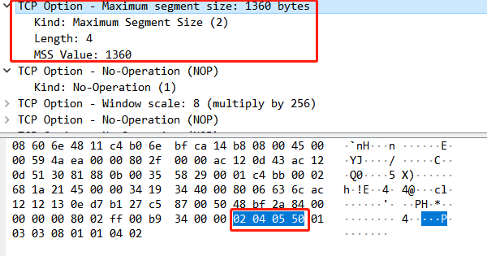

TCP选项-MSS

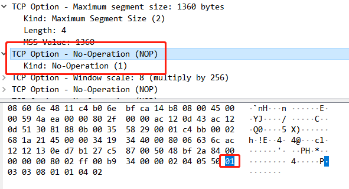

TCP选项-NOP
