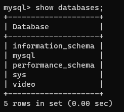
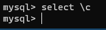
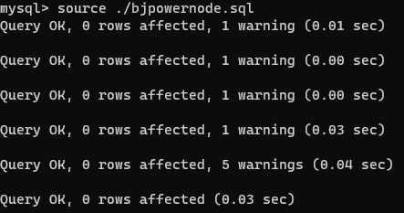
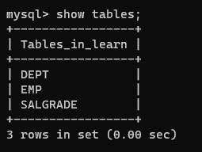
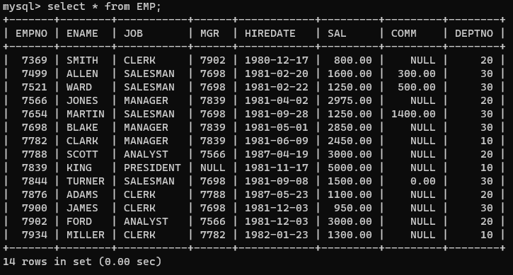
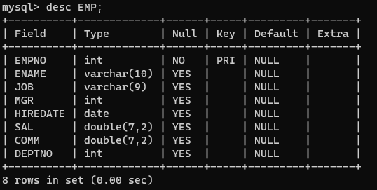

## Mysql教程

### SQL语句分类

* DQL:数据查询语言(凡是带有select关键词的都是查询语言)
* DML:数据操作语言(凡是对表进行增删改的，insert,update,delete都是DML)
* DDL:数据定义语言（凡是带有create，drop，alter的都是DDL，主要操作表的结构）
* TCL:事务控制语言(包括事务提交，事务回滚)
* DCL:数据控制语言(授权grant，撤销revoke)

### Docker创建Mysql

1.拉取Mysql镜像

```
docker pull mysql
```

2.建立Mysql容器

```
docker run -itd --name mysql-test -p 3306:3306 -e MYSQL_ROOT_PASSWORD=123456 mysql
```

3.进入Mysql容器

``docker exec -it 84d bash``

4.使用命令输入密码进入Mysql

```
mysql -u root -p 123456
```

### Mysql常用命令

1.展示有哪些数据库（Mysql默认自带4个数据库）

```
show databaes;
```



2.退出Mysql

```
exit;
```

3.选择数据库

```
use video;
```

4.创建一个叫video的数据库

```
create database video;
```

5.查看Mysql版本号

```
select version();
```

6.查询当前数据库名

```
select database();
```

7.加入\c取消当前SQL语句



### Mysql表

任何一张表都有行和列：

    行(row):被称为数据/记录。

    列(column):被称为字段。

每一个字段包含：字段名、数据类型、约束等属性

#### 常用操作

1.插入一张已有表

在windows Powersell中导入数据到docker中的mysql中/路径下

```
 docker cp C:\\Users\\faker\\Downloads\\bjpowernode.sql 8d4:/
```


然后在mysql中输入source命令从容器导入mysql

```
source ./bjpowernode.sql
```



2.展示当前数据库的所有表

```
show tables;
```

 

3.查看EMP表中的所有数据

```
select * from EMP;

```



4.查看EMP表的结构

```
desc EMP;
```


