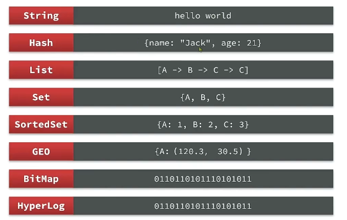
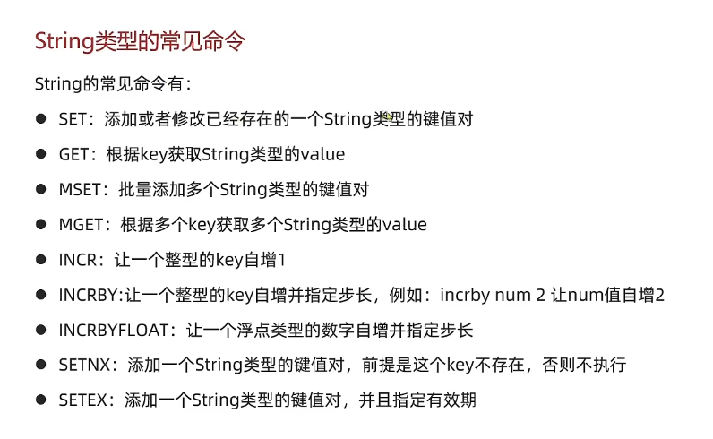

### redis 数据结构

redis是key-value的数据库。key1一般是string类型，value的类型是多种多样。

### Redis五大常用类型

* String：字符串
* Hash：哈希表
* List：链表
* Set：无序且不重复的集合
* SortedSet：有序且不重复的集合

### Redis常用命令

```
//通过模板patter查找key
KEYS pattern

//查找所有key
KEYS *

//删除Key，可以删多个，key不存在也可以
DEL k1 k2 k3 k4

//判断多个key是否存在
EXISTS k1 k2

//给key设置有效期，有效期到期时该key会被自动删除
EXPIRE key seconds

//TTL,查看key有效期,-1代表永久有效，-2代表过期
TLL key

```

### String类型

String类型，也就是字符串类型，是Redis中最简单的存储类型。

字符串类型的最大空间不能超过512m。

#### String类型的常用命令


