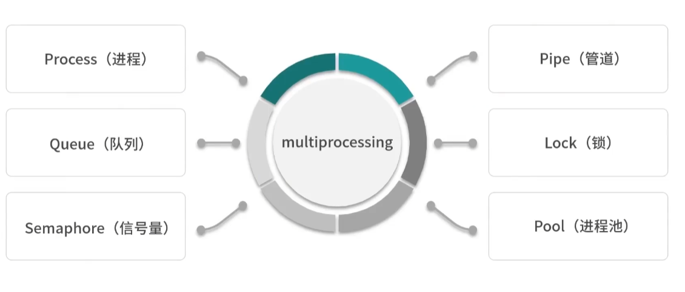

# Week 1

## Day1

*[Mysql学习笔记](../Databases/mysql.md)*

| Mysql本身               | Mysql数据库  | Mysql表          |
| ----------------------- | ------------ | ---------------- |
| 展示所有数据库          | 创建数据库   | 查看表中所有数据 |
| 退出Mysql               | 查看数据库名 | 查看表结构       |
| 查看Mysql版本号         |              |                  |
| 拷贝本地sql文件到数据库 |              |                  |

*[算法(贪心算法)](../Leetcode/leetcode.md)*

